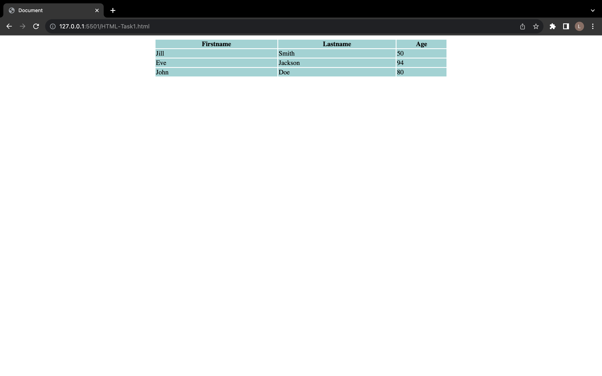
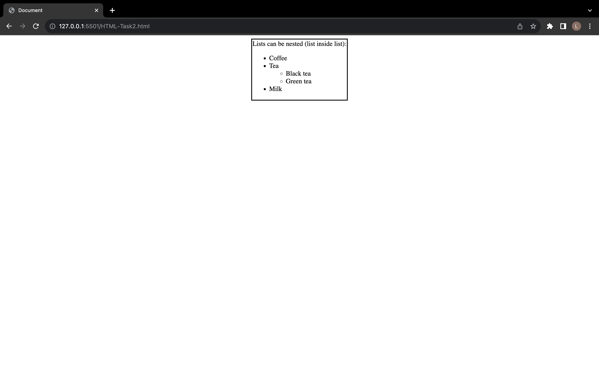
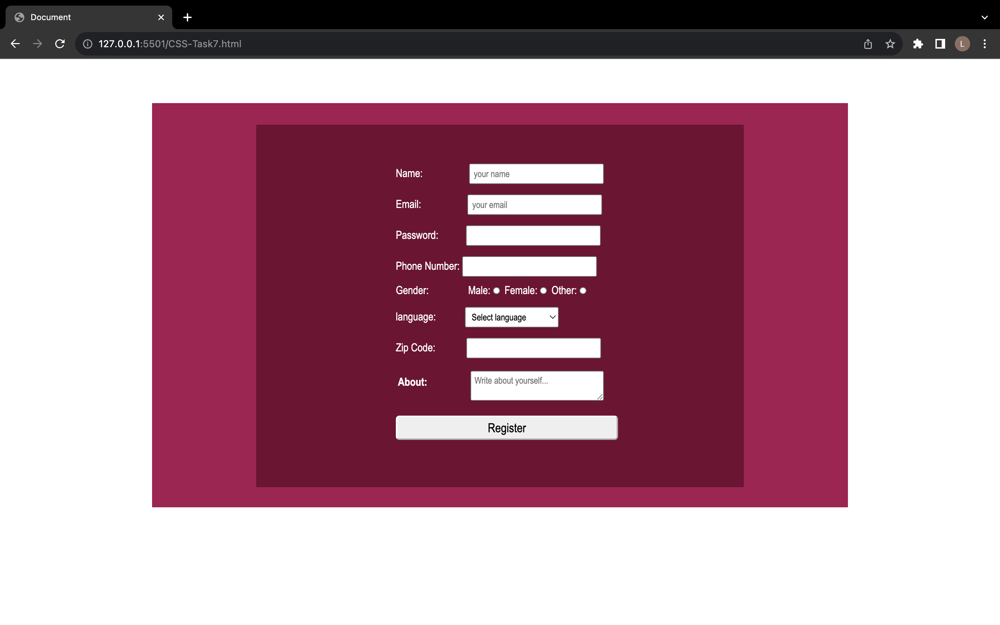

  Document

21BPS1205  
Lokesh Kumar Bhuyan
-------------------------------

Index page
==========

HTML task

Task Number

Link

Task1

[Link1](./HTML-Task1.html)

Task2

[Link2](./HTML-Task2.html)

Task3

[Link3](./HTML-Task3.html)

Task4

[Link4](./HTML-Task4.html)

Task5

[Link5](./HTML-Task5.html)

CSS task

Task Number

Link

Task1

[Link1](./CSS-Task1.html)

Task2

[Link2](./CSS-Task2.html)

Task3

[Link3](./CSS-Task3.html)

Task4

[Link4](./CSS-Task4.html)

Task5

[Link5](./CSS-Task5.html)

Task6

[Link6](./CSS-Task6.html)

Task7

[Link7](./CSS-Task7.html)

Screenshots img { max-width: 30%; height: auto; display: block; margin: 0 auto; } h2 { text-align: center; } h4 { text-align: center; }

HTML Task Screenshots
---------------------

#### Task 1

#### Task 2

#### Task 3

#### Task 4

#### Task 5

CSS Task Screenshots
--------------------

#### Task 1

#### Task 2

#### Task 3

#### Task 4

#### Task 5

#### Task 6

#### Task 7

